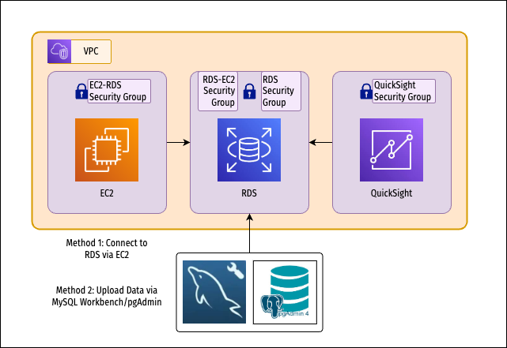

# awsProject3
A basic demo project on using Amazon RDS (MySQL/Postgres) and QuickSight

## 🏗️ Architecture

## 🧱 Setup Instructions
### Step 1: Create RDS database with public access
### Step 2A: Connect via MySQL Workbench / pgAdmin4 and create table
### Step 2B: Create EC2 instance, connect to RDS, and create table

## 🛠️ Configuration Details

## 🍽️ Usage Instructions

## 🚨 Troubleshooting
### Common Issues
- *Issue 1*: Unable to connect from MySQL Workbench
  - MySQL Workbench 8.0.40 on any platform presents a plugin loading error when using plain password authentication. Downgrade to 8.0.33 and set-up the connection again from there.
